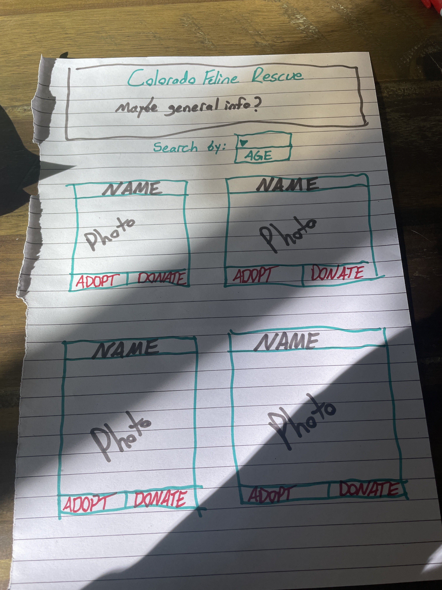
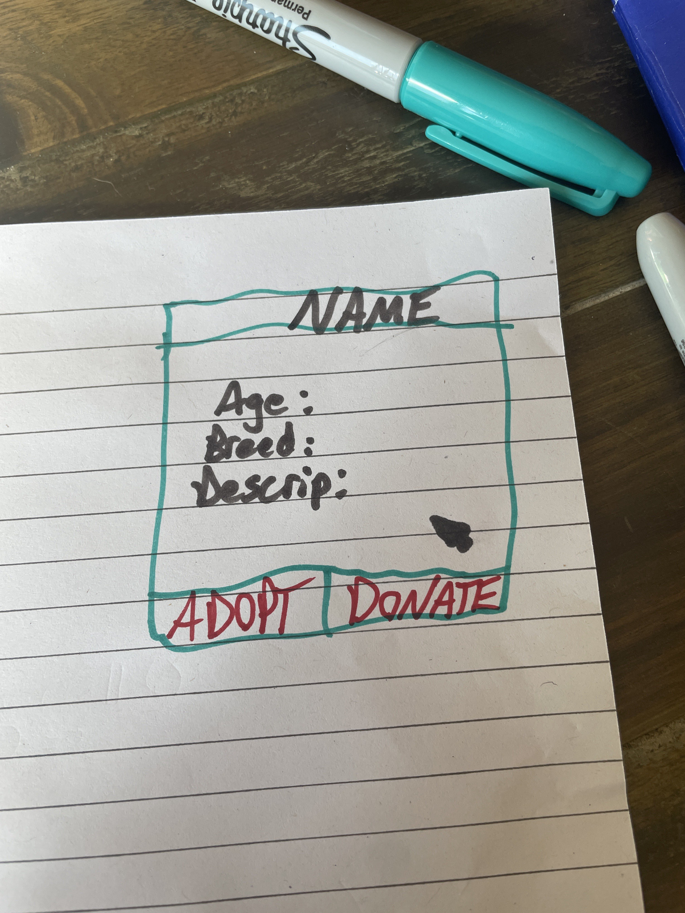

# FelineRescue

As a user I want to navigate an adoption page for a cat rescue. I would also like to be able to search for cats of a certain age group
 - All available cats should appear on page load.
 - then there should be a dropdown that shows age groups
 - when an age group is clicked, it filters through and shows only the cats in that age group on the page
 - each cat is featured on a card, that has two buttons
   - one button is a donation button, where people can donate toward the care of that cat
   - the other button is an adoption button, that when clicked, will remove that cat from the webpage

 - if time allows there will also be a mouseover modal function that allows the user to see more information about the cat
 

 **Contributors:**
 Anne Hastings
 Ryland Sherman

